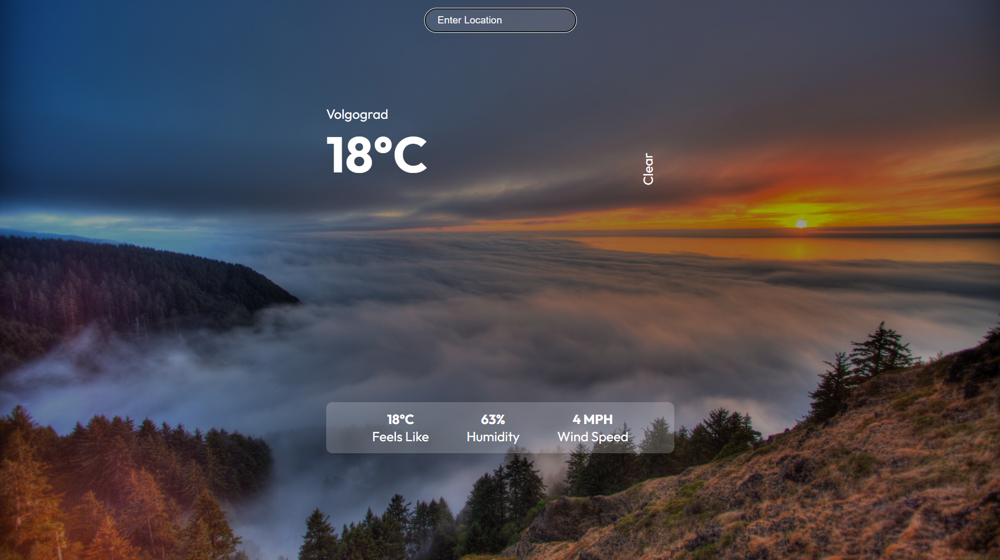

Una aplicación web desarrollada con React que muestra el tiempo actual de cualquier ciudad que escribas. Utiliza una API meteorológica para obtener datos actualizados como la temperatura, la descripción del clima y el icono correspondiente.

Durante este proyecto aprendí a:
  Integrar una API externa en una aplicación React.
  Manejar estados y efectos con useState y useEffect.
  Trabajar con promesas y asincronía en JavaScript.
  Diseñar una interfaz sencilla y responsive.

